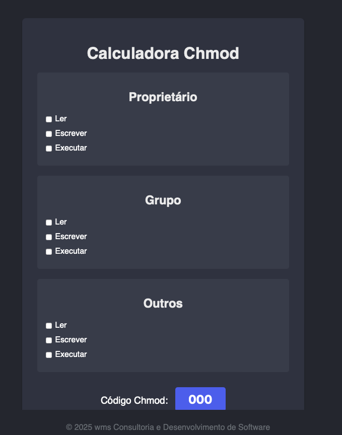

# Calculadora Chmod



#


#

Uma ferramenta web simples e intuitiva para converter permissões de arquivos Linux entre a representação numérica (chmod) e a representação simbólica (leitura, escrita, execução) para Proprietário, Grupo e Outros.

## Visão Geral

Este projeto consiste em uma página web que permite aos usuários selecionar facilmente as permissões desejadas para Proprietário, Grupo e Outros através de checkboxes. À medida que as permissões são selecionadas, o código Chmod numérico correspondente é gerado e exibido em tempo real.

## Funcionalidades

- **Interface Intuitiva:** Selecione as permissões desejadas marcando os checkboxes para Ler, Escrever e Executar para cada categoria de usuário (Proprietário, Grupo, Outros).
- **Geração em Tempo Real:** O código Chmod numérico é atualizado instantaneamente conforme as seleções são feitas.
- **Fácil de Usar:** Não requer instalação, basta abrir o arquivo `index.html` em qualquer navegador web.
- **Design Atraente:** Interface limpa e organizada com um tema escuro (`#282B35`) e elementos centralizados.

## Como Usar

[Para clonar o projeto](https://github.com/cabraldasilvac/calculadora-chmod.git)

1. **Download ou Clone:** Faça o download dos arquivos `index.html`, `style.css` e `script.js` ou clone este repositório para o seu computador.
2. **Abrir no Navegador:** Abra o arquivo `index.html` em seu navegador web preferido.
3. **Selecionar Permissões:** Marque as caixas de seleção correspondentes às permissões que você deseja conceder para Proprietário, Grupo e Outros.
   - **Ler (r):** Permite visualizar o conteúdo do arquivo. (Valor: 4)
   - **Escrever (w):** Permite modificar o conteúdo do arquivo. (Valor: 2)
   - **Executar (x):** Permite executar o arquivo (se for um executável). (Valor: 1)
4. **Visualizar Código Chmod:** O código Chmod numérico resultante será exibido automaticamente no campo "Código Chmod:".

**Exemplo:**

Se você deseja que:

- O **Proprietário** tenha permissão de leitura, escrita e execução (4 + 2 + 1 = 7).
- O **Grupo** tenha permissão de leitura e escrita (4 + 2 = 6).
- Os **Outros** tenham permissão de leitura (4).

Basta marcar as caixas correspondentes, e o código Chmod `764` será exibido.

## Estrutura do Projeto

[Tree](./images/img-tree.png)

## Tecnologias Utilizadas

- HTML
- CSS
- JavaScript

## Testes (Para Desenvolvedores)

Este projeto inclui testes unitários utilizando o framework Jest para garantir a funcionalidade correta da lógica JavaScript. Os testes foram configurados para rodar em um ambiente de navegador simulado (jsdom) para interagir com o DOM virtual.

### Como Executar os Testes

1. Certifique-se de ter o Node.js e o npm (ou yarn) instalados em sua máquina.
2. Navegue até o diretório do projeto no seu terminal.
3. Instale as dependências de desenvolvimento:

   ```bash
   npm install --save-dev jest
   # ou
   yarn add --dev jest
   ```

4. Execute os testes:

   ```bash
   npm test
   # ou
   yarn test
   ```

Todos os testes devem passar para garantir que a lógica da calculadora está funcionando conforme o esperado. Os testes verificam a função `updateChmod` diretamente, simulando o estado dos checkboxes e verificando se o código Chmod resultante é calculado corretamente.

## Copyright

&copy; 2025 WMS - Consultoria e Desenvolvimento de Software

## Contribuições

Contribuições são bem-vindas! Sinta-se à vontade para abrir issues para relatar bugs ou sugerir melhorias. Pull requests também são encorajados.

**_Leia:_** [LICENSE.md](https://github.com/cabraldasilvac/calculadora-chmod/blob/main/CONTRIBUTING.md) o arquivo para mais detalhes..

## Licença

## Este projeto está sob a licença MIT. Leia: [LICENSE.md](https://github.com/cabraldasilvac/calculadora-chmod/blob/main/LICENSE.md) o arquivo para mais detalhes..
